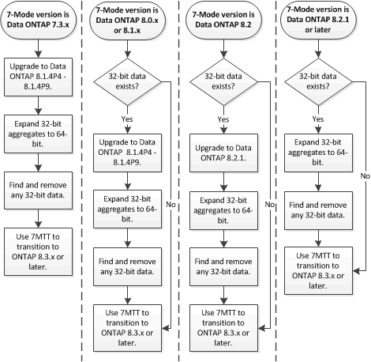

= Préparation à la transition vers ONTAP 8.3 et versions ultérieures prises en charge
:allow-uri-read: 
:icons: font
:imagesdir: ../media/

[role="lead"]
Les agrégats, volumes et copies Snapshot 32 bits ne sont pas pris en charge par ONTAP 8.3 et les versions ultérieures. Vous devez donc développer les agrégats 32 bits sur 64 bits, puis rechercher et supprimer tous les volumes 32 bits et toutes les copies Snapshot du système 7-mode avant la transition. Toutes les versions 7-mode ne prennent pas en charge l'extension des agrégats 32 bits et la suppression des volumes 32 bits et des copies Snapshot, vous devrez peut-être mettre à niveau votre système 7-mode avant la transition.

NOTE: Clustered Data ONTAP 8.2.x prend en charge les agrégats 32 bits, les volumes et les copies Snapshot. Il est donc possible de passer des données 32 bits d'un système 7-mode à un cluster cible exécutant Data ONTAP 8.2.x. Cependant, après la transition, si le cluster cible doit être mis à niveau vers ONTAP 8.3 ou une version ultérieure , vous devez mettre à niveau toutes les données 32 bits existantes du cluster cible vers le format 64 bits avant de mettre à niveau la version ONTAP du cluster cible.

Utilisez le workflow suivant pour décider si une mise à niveau est requise avant la transition.

*Informations connexes*

https://www.netapp.com/pdf.html?item=/media/19679-tr-3978.pdf["Rapport technique NetApp 3978 : mise à niveau d'agrégats 32 bits en agrégats 64 bits sans déplacement des données : présentation et meilleures pratiques"^]
