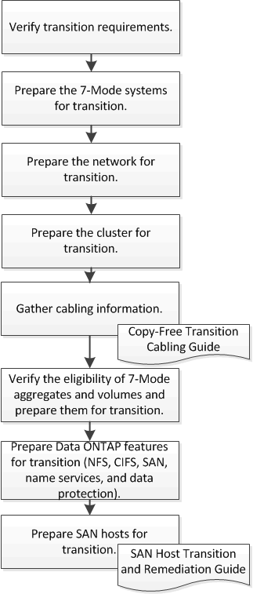

= Préparation à la transition sans copie
:allow-uri-read: 
:icons: font
:imagesdir: ../media/

[role="lead"]
Avant de démarrer la transition sans copie, vous devez identifier la paire haute disponibilité 7-mode à effectuer la transition, comprendre les exigences et les restrictions de migration, et préparer les systèmes 7-mode et un cluster à la transition. Vous devez également connaître les fonctionnalités Data ONTAP prises en charge et non prises en charge pour la transition.

*Informations connexes*

https://mysupport.netapp.com/matrix["Matrice d'interopérabilité NetApp"]
