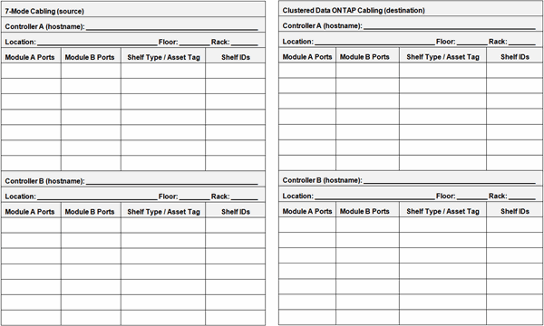

= Fiche technique de câblage de transition sans copie
:allow-uri-read: 
:icons: font
:imagesdir: ../media/

[role="lead"]
Vous pouvez utiliser la fiche technique de câblage de transition sans copie pour planifier le câblage. Vous devez enregistrer des informations sur les ports et les tiroirs disques connectés aux contrôleurs 7-mode et aux nœuds de cluster cibles. Vous devez également enregistrer les ports à utiliser pour la connexion des tiroirs disques 7-mode aux nœuds de cluster cibles.

* Ports du module A/B : connexions des ports pour le module A/B
* Type de tiroir/étiquette d'inventaire : type de tiroir disque
* Identifiants de tiroir : ID de tiroir disque

== Exemple de fiche de câblage

|===
4+| Câblage 7-mode 4+| Câblage pour clustered Data ONTAP 

4+| Contrôleur A (nom d'hôte) : 7hostA 4+| Nœud A (nom d'hôte) : cluster1-01 

4+| Emplacement : étage du Colorado : troisième rack : 8 4+| Emplacement : étage du Colorado : cinquième rack : 3 

| Ports du module A | Ports du module B | Type de tablette/étiquette d'inventaire | ID de tiroirs | Ports du module A | Ports du module B | Type de tablette/étiquette d'inventaire | ID de tiroirs 

 a| 
1 a.
 a| 
0a
 a| 
DS4243/150254-7
 a| 
10-13
 a| 
1 a.
 a| 
0a
 a| 
DS4243/174243-2
 a| 
10-11

 a| 
1b
 a| 
0b
 a| 
DS4243/151205-2
 a| 
30-37
 a| 
1b
 a| 
0b
 a| 
DS4243/150254-7
 a| 
20-23

 a| 
1c (hors ligne)
 a| 
0c (hors ligne)
 a| 
s/o
 a| 
s/o
 a| 
1c
 a| 
0 °c.
 a| 
DS4243/151205-2
 a| 
30-37

 a| 
1d
 a| 
0d
 a| 
DS4243/143921-4
 a| 
14-15
 a| 
1d
 a| 
0d
 a| 
DS4243/143921-4
 a| 
14-15

 a| 
*Contrôleur B (nom d'hôte) : 7hostB*
 a| 
*Nœud B (nom d'hôte):cluster1-02*

 a| 
*Lieu: Étage du Colorado: Troisième rack: 8*
 a| 
*Lieu: Étage du Colorado: Cinquième rack: 3*

 a| 
*Ports du module A*
 a| 
*Ports du module B*
 a| 
*Type de tablette/étiquette d'inventaire*
 a| 
*ID de tablette*
 a| 
*Ports du module A*
 a| 
*Ports du module B*
 a| 
*Type de tablette/étiquette d'inventaire*
 a| 
*ID de tablette*

 a| 
1 a.
 a| 
0a
 a| 
DS4243/174263-6
 a| 
10-13
 a| 
1 a.
 a| 
0a
 a| 
DS4243/174233-2
 a| 
10-11

 a| 
1b (hors ligne)
 a| 
0b (hors ligne)
 a| 
s/o
 a| 
s/o
 a| 
1b
 a| 
0b
 a| 
DS4243/174263-6
 a| 
20-23

 a| 
1c
 a| 
0 °c.
 a| 
DS4243/174274-9
 a| 
30-37
 a| 
1c
 a| 
0 °c.
 a| 
DS4243/174274-9
 a| 
30-37

 a| 
1d
 a| 
0d
 a| 
DS4243/174285-6
 a| 
14-15
 a| 
1d
 a| 
0d
 a| 
DS4243/174285-6
 a| 
14-15

|===