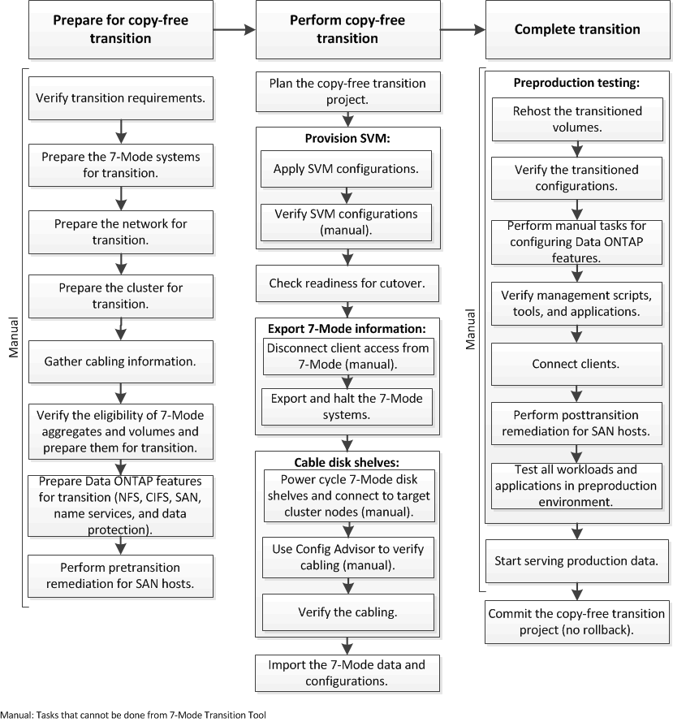

= Transition sans copie au flux de travail
:allow-uri-read: 
:icons: font
:imagesdir: ../media/

[role="lead"]
Le workflow de transition sans copie comprend la préparation à la transition, la transition et la fin de la transition. Certaines de ces tâches doivent être effectuées manuellement sur les systèmes 7-mode et le cluster.

