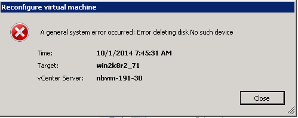

= Suppression de RDM obsolètes à l'aide du client vSphere
:allow-uri-read: 
:icons: font
:imagesdir: ../media/

[role="lead"]
Tous les LUN RDM deviennent obsolètes lors de la transition de ONTAP sous 7-mode vers clustered Data ONTAP. Après la transition, les RDM doivent être supprimés et reconnectés avant que les LUN ne puissent commencer la maintenance des données.

Vous devez disposer du nom de la machine virtuelle et du chemin d'accès au disque du RDM dans le _Inventory Assessment Workbook_.

.Étapes
. Ouvrez l'hôte ESXi ou le serveur vCenter gérant l'hôte ESXi.
. Cliquez avec le bouton droit de la souris sur la VM, puis sélectionnez *Modifier les paramètres*.
+
La fenêtre VM Properties s'affiche.

. Sélectionnez le disque dur dans la liste des périphériques utilisant le chemin du disque dans le _Inventory Assessment Workbook_.
. Notez les *Virtual Device Node* et *Compatibility mode* dans la fenêtre VM Properties.
+
Nœud de périphérique virtuel : SCSI 0:2

+
Mode de compatibilité : physique

. Cliquez sur *Supprimer*.
. Sélectionnez *Supprimer de la machine virtuelle et supprimez des fichiers du disque*.
. Cliquez sur *OK*.
+
Un message d'erreur similaire à ce qui suit s'affiche. Vous pouvez ignorer ce message.

+

. Cliquez sur *Fermer*.

